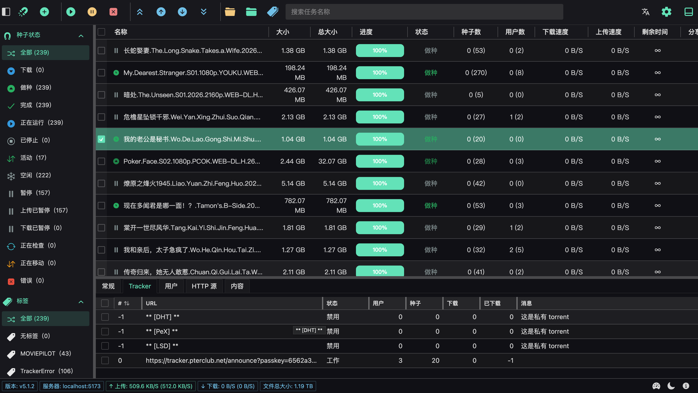
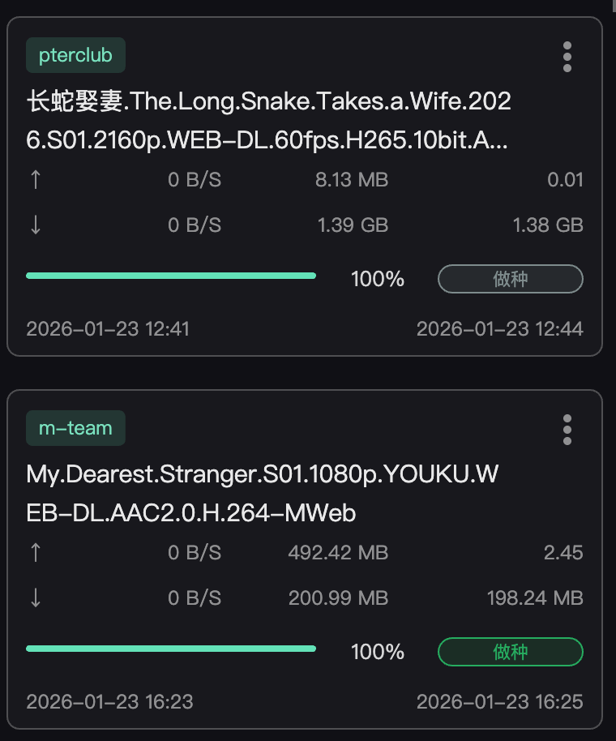
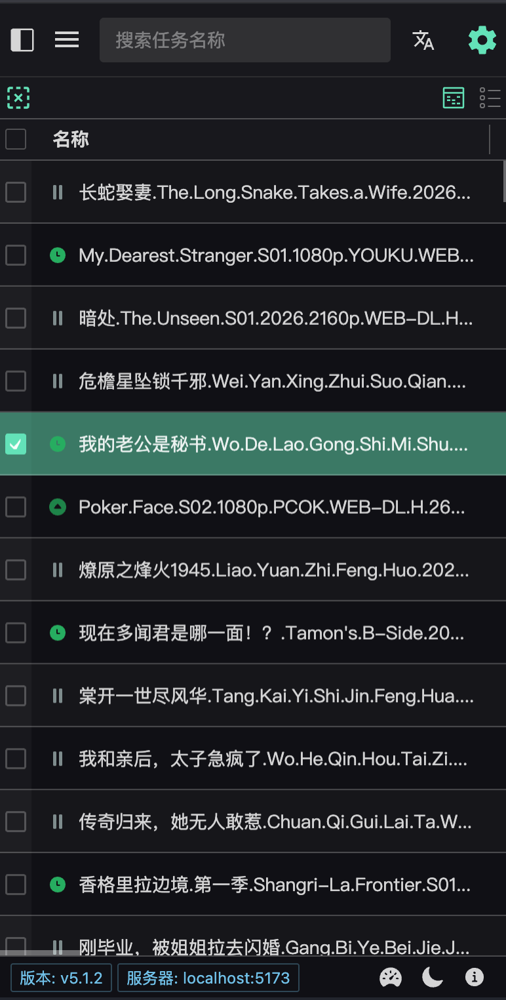
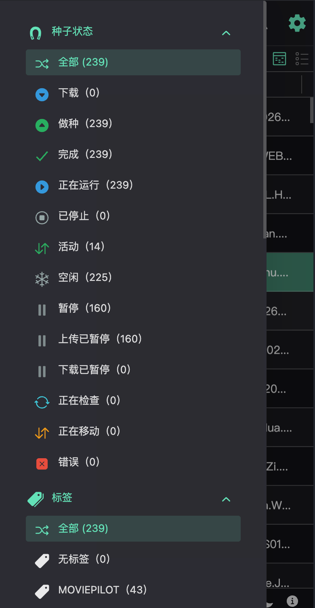
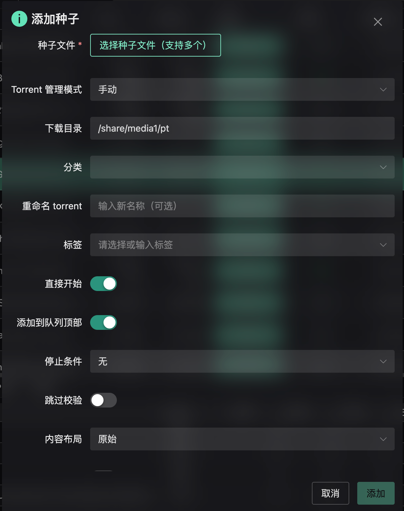

# qb-web

[English](README.md) | [简体中文](README.zh-CN.md)

[](https://github.com/jianxcao/qb-web/releases)
[](https://github.com/jianxcao/qb-web/stargazers)
[](LICENSE)
[](package.json)

A modern, feature-rich web interface for qBittorrent client management, built with Vue 3, TypeScript, and Naive UI. Designed for both desktop and mobile devices with responsive design, virtual scrolling for high performance, and intelligent torrent filtering.

> 💡 **If you find this project helpful, please consider giving it a ⭐ Star on GitHub!** It helps more people discover this project and motivates me to keep improving it. Thank you! 🙏

## ✨ Features

- 🚀 **Modern Tech Stack** - Built with Vue 3 (Composition API), TypeScript, and Vite for blazing-fast development
- 📱 **Responsive Design** - Mobile-first UI that works seamlessly across desktop, tablet, and mobile devices
- ⚡ **High Performance** - Virtual scrolling for smooth handling of large torrent lists
- 🎨 **Beautiful UI** - Powered by Naive UI with a clean, modern interface
- 🌍 **Internationalization** - Multi-language support (English, 简体中文)
- 🔒 **Secure Authentication** - Login protection and session management
- 📊 **Real-time Statistics** - Live updates for torrent status, speed, and progress
- 🎯 **Smart Filtering** - Advanced torrent filtering by status, category, and tags
- 📁 **File Management** - Browse and manage torrent contents with ease
- 🔄 **Drag & Drop** - Intuitive torrent file and magnet link handling
- ⚙️ **Comprehensive Settings** - Full control over qBittorrent client settings
- 🐳 **Docker Support** - Easy deployment with Docker and Docker Compose

## Interface Preview







## 🐳 Docker Deployment (Recommended)

The easiest way to deploy qb-web is using the pre-built Docker image from Docker Hub.

### Using Docker Compose (Recommended)

Create a `docker-compose.yml` file:

```yaml
services:
  qb-web:
    image: jianxcao/qbittorrent-web
    container_name: qb-web
    environment:
      - BACKEND_URL=http://127.0.0.1:9091
    ports:
      - '7633:7633'
    restart: unless-stopped
```

Then run:

```bash
docker-compose up -d
```

### Using Docker CLI

```bash
docker run -d \
  --name qb-web \
  -p 7633:7633 \
  -e BACKEND_URL=http://127.0.0.1:9091 \
  --restart unless-stopped \
  jianxcao/qbittorrent-web
```

### Build from Source (Optional)

If you want to build the image yourself:

```bash
# Clone the repository
git clone https://github.com/jianxcao/qb-web.git
cd qb-web

# Build the image
docker build -t qb-web .

# Run the container
docker run -d \
  --name qb-web \
  -p 7633:7633 \
  -e BACKEND_URL=http://your-qbittorrent:8080 \
  --restart unless-stopped \
  qb-web
```

### Environment Variables

| Variable      | Description                   | Default                 | Required |
| ------------- | ----------------------------- | ----------------------- | -------- |
| `BACKEND_URL` | qBittorrent WebUI API URL     | `http://localhost:9091` | Yes      |
| `PORT`        | Port to run the web interface | `7633`                  | No       |
| `PUID`        | User ID for file permissions  | `0`                     | No       |
| `PGID`        | Group ID for file permissions | `0`                     | No       |
| `UMASK`       | File creation mask            | `000`                   | No       |

> **Note**: Make sure to replace `BACKEND_URL` with your actual qBittorrent WebUI address. If qBittorrent is running in another container, use the container name or service name (e.g., `http://qbittorrent:8080`).

## 📦 Local Development Installation

### Prerequisites

- **Node.js** >= 20.0.0
- **pnpm** >= 10.0.0
- **qBittorrent** with WebUI API enabled

### Clone and Install

```bash
git clone https://github.com/jianxcao/qb-web.git
cd qb-web
pnpm install
```

### Environment Configuration

Create a `.env.local` file in the project root:

```env
VITE_BASE_URL=/api/v2
```

## 🚀 Usage

### Development

Start the development server with hot module replacement:

```bash
pnpm dev
```

The application will be available at `http://localhost:5173`

### Build for Production

Build the optimized production bundle:

```bash
pnpm build
```

The build output will be in the `dist/` directory.

### Preview Production Build

Preview the production build locally:

```bash
pnpm preview
```

### Type Checking

Run TypeScript type checking:

```bash
pnpm check
```

### Linting

Run ESLint to check and fix code style:

```bash
pnpm lint
```

## 🛠️ Development

### Project Structure

```
src/
├── api/              # API layer with qBittorrent WebUI integration
│   ├── modules/      # API modules (torrents, auth, rss, etc.)
│   ├── http.ts       # HTTP client configuration
│   ├── types.ts      # TypeScript type definitions
│   └── index.ts      # API exports
├── components/       # Vue components
│   ├── CanvasList/   # High-performance virtual list component
│   ├── dialog/       # Dialog components (Settings, Add Torrent, etc.)
│   └── Settings/     # Settings panels
├── composables/      # Reusable composition functions
│   ├── useColumns.ts # Table column management
│   ├── useI18n.ts    # Internationalization helper
│   └── useSelection.ts # Selection state management
├── store/            # Pinia stores
│   ├── torrent.ts    # Torrent state management
│   ├── setting.ts    # Application settings
│   └── session.ts    # Session and authentication
├── views/            # Page-level components
│   ├── DashboardView.vue # Main torrent dashboard
│   ├── LoginView.vue     # Login page
│   └── SettingsView.vue  # Settings page
├── router/           # Vue Router configuration
├── i18n/             # Internationalization files
│   └── locales/      # Language files (en-US, zh-CN)
├── utils/            # Utility functions
└── styles/           # Global styles
```

### Tech Stack

| Category             | Technology                       |
| -------------------- | -------------------------------- |
| **Framework**        | Vue 3.5.27 (Composition API)     |
| **Language**         | TypeScript 5.8.3                 |
| **Build Tool**       | Vite 7.0.0 (with rolldown)       |
| **UI Library**       | Naive UI 2.43.2                  |
| **State Management** | Pinia 3.0.4                      |
| **Routing**          | Vue Router 4.6.4                 |
| **HTTP Client**      | Axios 1.13.2                     |
| **Styling**          | UnoCSS 66.6.0 + Less 4.5.1       |
| **I18n**             | Vue I18n 9.14.5                  |
| **Utilities**        | VueUse 13.9.0, Lodash-es 4.17.23 |

### Available Scripts

| Command              | Description                             |
| -------------------- | --------------------------------------- |
| `pnpm dev`           | Start development server on port 5173   |
| `pnpm build`         | Type-check and build for production     |
| `pnpm build:prod`    | Production build with environment setup |
| `pnpm check`         | TypeScript type checking only           |
| `pnpm preview`       | Preview production build locally        |
| `pnpm lint`          | ESLint with auto-fix                    |
| `pnpm lint:fix`      | Same as lint (auto-fix enabled)         |
| `pnpm release`       | GitHub Actions release                  |
| `pnpm release:check` | Environment validation                  |

### Code Style

This project follows these conventions:

- **No semicolons** (enforced by ESLint)
- **Single quotes** for strings
- **2 spaces** for indentation
- **120 characters** max line width
- **Composition API** for all Vue components
- **TypeScript strict mode** enabled

For more details, see [AGENTS.md](AGENTS.md).

## 🌐 API Integration

This project integrates with the qBittorrent WebUI API (v4.1+). For API documentation, see:

- [qBittorrent WebUI API Documentation](<https://github.com/qbittorrent/qBittorrent/wiki/WebUI-API-(qBittorrent-4.1)>)

### Supported API Endpoints

- **Authentication** - Login, logout, session management
- **Torrents** - List, add, delete, pause, resume, set properties
- **Transfer** - Global speed limits, connection settings
- **Application** - Preferences, default save path
- **RSS** - Feed management and rules
- **Log** - Main log and peer log
- **Search** - Plugin management and search operations
- **Sync** - Main data synchronization

## 🤝 Contributing

Contributions are welcome! Here's how you can help:

1. Fork the repository
2. Create your feature branch (`git checkout -b feature/amazing-feature`)
3. Commit your changes (`git commit -m 'feat: add amazing feature'`)
4. Push to the branch (`git push origin feature/amazing-feature`)
5. Open a Pull Request

Please ensure your code:

- Passes TypeScript type checking (`pnpm check`)
- Follows the code style guidelines (`pnpm lint`)
- Includes appropriate documentation

## 📝 Release Process

This project uses automated releases via GitHub Actions:

1. Validate your environment: `pnpm release:check`
2. Trigger the release workflow: `pnpm release`
3. Semantic versioning and changelog generation are automated

## 📄 License

This project is licensed under the [MIT License](LICENSE).

Copyright (c) 2024-2026 Jianxiong Cao

## 🙏 Acknowledgments

Built with these excellent open-source projects:

- [Vue 3](https://vuejs.org/) - Progressive JavaScript Framework
- [Naive UI](https://www.naiveui.com/) - Vue 3 Component Library
- [Vite](https://vitejs.dev/) - Next Generation Frontend Tooling
- [qBittorrent](https://www.qbittorrent.org/) - Free BitTorrent Client
- [TypeScript](https://www.typescriptlang.org/) - Typed JavaScript
- [Pinia](https://pinia.vuejs.org/) - Vue Store
- [UnoCSS](https://unocss.dev/) - Instant On-demand Atomic CSS Engine

## ⭐ Star History

If you like this project, please give it a star! ⭐

[](https://star-history.com/#jianxcao/qb-web&Date)

## 📞 Support

- **Issues**: [GitHub Issues](https://github.com/jianxcao/qb-web/issues)
- **Discussions**: [GitHub Discussions](https://github.com/jianxcao/qb-web/discussions)

---

Made with ❤️ by [Jianxiong Cao](https://github.com/jianxcao)
